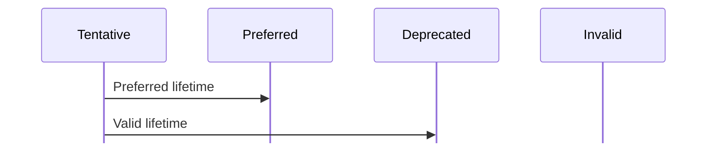

# IPv6 Neighbor Discovery

RouterOS supports IPv6 Neighbor Discovery and stateless address autoconfiguration by using Router Advertisement Daemon (RADVD).

## Standards

- [`RFC 4861`](https://tools.ietf.org/html/rfc4861) - Neighbor Discovery for IP version 6 (IPv6).
- [`RFC 4862`](https://tools.ietf.org/html/rfc4862) - IPv6 Stateless Address Autoconfiguration

## Node description

A node is a device that implements IPv6. In IPv6 networks nodes are divided into two types:

- **Routers** - nodes that forward IPv6 packets not explicitly addressed to themselves.
- **Hosts** - any nodes that are not routers.

Routers and hosts are distinct classifications defined in RFC 4861, but a single device can perform both roles: forwarding packets (router) and receiving traffic addressed to itself (host).

## Stateless address autoconfiguration

There are several types of autoconfiguration:

- *stateless* - address configuration is done by receiving Router Advertisement messages. These messages include stateless address prefixes and require that the host is not using a stateful address configuration protocol.
- *stateful* - address configuration is done by using the stateful address configuration protocol (DHCPv6). The stateful protocol is used if RA messages do not include address prefixes.
- *both* - RA messages include stateless address prefixes and require that hosts use a stateful address configuration protocol.

IPv6 can automatically configure itself without using a stateful configuration protocol such as DHCP ([example](#stateless-autoconfiguration-example)).

:::info
Address autoconfiguration can only be performed on multicast-capable interfaces.
:::

This process is called stateless address autoconfiguration because the router does not manage state. It is a simple, robust, and effective method.

RouterOS uses RADVD to periodically advertise information about the link to all nodes on the same link. The information is carried by an ICMPv6 "router advertisement" packet, and includes the following fields:

- IPv6 subnet prefix.
- Default router link-local address.
- Other parameters that may be optional are: link MTU, default hop limit, and router lifetime.

Host uses the advertisement to configure the global IPv6 address and the default router. The global IPv6 address is generated from the advertised [subnet prefix](https://manual.mikrotik.com/docs/getting-started/networking-fundamentals/ipv6-addresses) and the EUI-64 [interface identifier](https://manual.mikrotik.com/docs/getting-started/networking-fundamentals/ipv6-addresses#interface-identifier).

You can request an advertisement by sending an ICMPv6 router solicitation packet. On Linux, the **rtsol** utility sends router solicitations. Mobile nodes should transmit router solicitations periodically.

### Address states

When an auto-configuration address is assigned, it can be in one of the following states:

- ***`tentative`*** - in this state the host verifies that the address is unique. Verification occurs through duplicate address detection.
- ***`preferred`*** - at this state the address is verified as unique and the node can send and receive unicast traffic to and from a preferred address. The period of time of the preferred state is included in the RA message.
- ***`deprecated`*** - the address is still valid, but is not used for new connections.
- ***`invalid`*** - the node can no longer send or receive unicast traffic. An address enters the invalid state after the valid lifetime expires.

The following diagram illustrates the relation between states and lifetimes:



## Neighbor discovery

Neighbor Discovery (ND) uses messages and processes to determine relationships between neighboring nodes. Compared to IPv4, ND replaces Address Resolution Protocol (ARP), ICMP Router Discovery, and ICMP Redirect while providing additional functionality.

Hosts use ND to:

- Discover neighboring routers.
- Discover addresses, address prefixes, and other configuration parameters.

Routers use ND to:

- Advertise their presence, host configuration parameters, and on-link prefixes.
- Inform hosts of a better next-hop address for a specific destination.

Nodes use ND to:

- Resolve the link-layer address of a neighboring node to which an IPv6 packet is being forwarded and determine when that address changes.
- Determine whether IPv6 packets can be sent to and received from a neighbor.

RFC 4861 defines five ND message types: Router Solicitation (RS), Router Advertisement (RA), Neighbor Solicitation (NS), Neighbor Advertisement (NA), and Redirect. Adding an interface to [`/ipv6/nd`](https://manual.mikrotik.com/docs/cli-reference/ipv6/nd) activates only the router-side messages:

- Router Solicitation (RS) – The router listens for an RS sent by hosts and replies with a Router Advertisement.
- Router Advertisement (RA) – The router sends periodic unsolicited RAs and also responds to any RS it receives. The content of the RA (prefixes, flag bitmaps, lifetime, MTU, timer values) is taken from the per‑interface [`/ipv6/nd`](https://manual.mikrotik.com/docs/cli-reference/ipv6/nd) settings and any [`/ipv6/nd/prefix`](https://manual.mikrotik.com/docs/cli-reference/ipv6/nd/prefix) entries.
- Neighbor Solicitation (NS) – The router replies with a Neighbor Advertisement when it receives an NS for any of its own addresses on that interface (link‑local, SLAAC, or static). This also covers Duplicate Address Detection (DAD) for the router's own address.
- Neighbor Advertisement (NA) – Sent in response to an NS (as above). Unsolicited NAs are not sent unless explicitly enabled.

Host‑to‑host NS/NA between end devices is handled automatically by the host stack and is not controlled by the [`/ipv6/nd`](https://manual.mikrotik.com/docs/cli-reference/ipv6/nd) menu. Redirect generation is optional and disabled by default (`redirect=no`).

## Examples

#### Stateless autoconfiguration example

```ros
[admin@MikroTik] > ipv6 address print
Flags: X - disabled, I - invalid, D - dynamic, G - global, L - link-local
# ADDRESS INTERFACE ADVERTISE
0 G 2001:db8::1/64 ether1 yes

```

In this example, the [`advertise`](https://manual.mikrotik.com/docs/cli-reference/ipv6/address#advertise_) flag is enabled, which indicates that a dynamic [`/ipv6/nd/prefix`](https://manual.mikrotik.com/docs/cli-reference/ipv6/nd/prefix) entry was added.

```ros
[admin@MikroTik] > /ipv6/nd/prefix/print
Flags: X - disabled, I - invalid, D - dynamic
0 D prefix=2001:db8::/64 interface=ether1 on-link=yes autonomous=yes
 valid-lifetime=4w2d preferred-lifetime=1w
```

On a host that is directly attached to the router, we see that an address was added. The address consists of the prefix part (first 64 bits) that takes the prefix from the prefix advertisement, and the host part (last 64 bits) that is automatically generated from the local MAC address:

```ros
atis@atis-desktop:~$ ip -6 addr
 1: lo: <LOOPBACK,UP,LOWER_UP> mtu 16436
inet6 ::1/128 scope host
valid_lft forever preferred_lft forever
2: eth0: <BROADCAST,MULTICAST,UP,LOWER_UP> mtu 1500 qlen 1000
inet6 2001:db8::21a:4dff:fe56:1f4d/64 scope global dynamic
 valid_lft 2588363sec preferred_lft 601163sec
inet6 fe80::21a:4dff:fe56:1f4d/64 scope link
valid_lft forever preferred_lft forever
```

The host has received the *2001:db8::/64* prefix from the router and configured an address with it.

You can also redistribute [DNS](https://manual.mikrotik.com/docs/network-management/dns) server information by using RADVD:

```ros
[admin@MikroTik] > /ipv6/nd/set [find where interface=all] dns=2001:db8::2 advertise-dns=yes
```

Or you can distribute your own router LL IPv6 address as DNS server and use router itself as DNS cache:

```ros
[admin@MikroTik] > /ipv6/nd/set [find where interface=all] advertise-dns=self
```

If you advertise specific servers, then every RA also includes the router's own LL address as DNS server, but as an already expired server. This is necessary to invalidate this server, if it was used before (if you changed settings between self and yes options). Any client which properly handles RA DNS ignores this server or invalidates the existing server, if it was the router itself.

You need client-side software with Router Advertisement DNS support to use the advertised DNS information.

On Ubuntu/Debian Linux distributions you can install the **rdnssd** package which is capable of receiving the advertised DNS addresses.

```ros
mrz@bumba:/$ sudo apt-get install rdnssd
```

```ros
mrz@bumba:/$ cat /etc/resolv.conf
# Dynamic resolv.conf(5) file for glibc resolver(3) generated by resolvconf(8)
 # DO NOT EDIT THIS FILE BY HAND -- YOUR CHANGES WILL BE OVERWRITTEN
 nameserver 2001:db8::2

mrz@bumba:/$ ping6 www.mikrotik.com
PING www.mikrotik.com(2a02:610:7501:1000::2) 56 data bytes
 64 bytes from 2a02:610:7501:1000::2: icmp_seq=1 ttl=61 time=2.11 ms
 64 bytes from 2a02:610:7501:1000::2: icmp_seq=2 ttl=61 time=1.33 ms
^C
 --- www.mikrotik.com ping statistics ---
2 packets transmitted, 2 received, 0% packet loss, time 1001ms
rtt min/avg/max/mdev = 1.334/1.725/2.117/0.393 ms
mrz@bumba:/$
```
