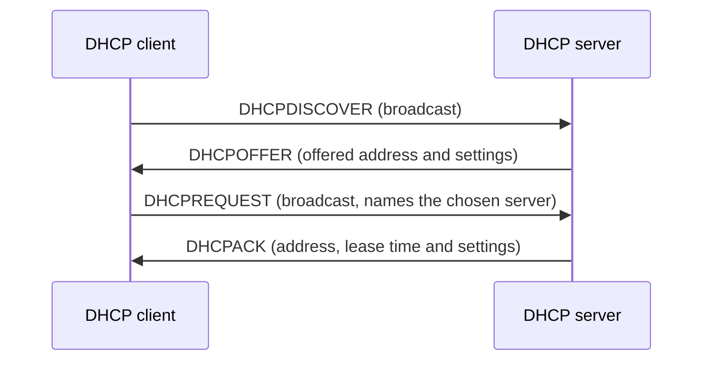

# DHCP

Dynamic Host Configuration Protocol (DHCP) assigns IP addresses and other network settings to hosts automatically, so they do not need to be configured by hand. A DHCP server manages a range of addresses and leases them to clients for a limited time, together with settings such as the subnet mask, default gateway and DNS servers.

RouterOS implements DHCP for IPv4 according to RFC 2131 and DHCPv6 according to RFC 8415, with a client, a server and a relay for each.

## RouterOS components

| Component | Menu | Use it to |
| :-- | :-- | :-- |
| [DHCP client](https://manual.mikrotik.com/docs/network-management/client) | `/ip/dhcp-client` | Get an IPv4 address and network settings for an interface, for example from an ISP. |
| [DHCP server](https://manual.mikrotik.com/docs/network-management/server) | `/ip/dhcp-server` | Assign IPv4 addresses and network settings to hosts on a local network. |
| [DHCP relay](https://manual.mikrotik.com/docs/network-management/relay) | `/ip/dhcp-relay`, `/ipv6/dhcp-relay` | Forward client requests to a DHCP or DHCPv6 server in another network. |
| [DHCPv6 client](https://manual.mikrotik.com/docs/network-management/dhcpv6-client) | `/ipv6/dhcp-client` | Get IPv6 addresses or a delegated IPv6 prefix, for example from an ISP. |
| [DHCPv6 server](https://manual.mikrotik.com/docs/network-management/dhcpv6-server) | `/ipv6/dhcp-server` | Delegate IPv6 prefixes or assign IPv6 addresses to clients. |

## How a client gets an address

A host without an IP address cannot send or receive ordinary unicast IP traffic, so the first DHCP messages are broadcasts. Clients send from UDP port 68 to port 67, where the servers listen. Getting an address takes four messages (RFC 2131, section 3.1):

1. The client broadcasts a DHCPDISCOVER message to find the servers on the network.
2. Each server that can serve the client replies with a DHCPOFFER message that contains a proposed IP address and settings.
3. The client chooses one offer and broadcasts a DHCPREQUEST message that identifies the chosen server. The other servers see that their offers were not accepted and return the offered addresses to their pools.
4. The chosen server confirms with a DHCPACK message, and the client configures the address. If the address is no longer available, the server replies with DHCPNAK instead, and the client starts over.

Until the client has configured its address, the server either broadcasts its replies or sends them as unicast to the client's MAC address and the offered IP address. A client that cannot receive such unicast replies sets the broadcast flag in its messages, and the server then broadcasts its replies (RFC 2131, section 4.1). In RouterOS, the `use-broadcast` property of the DHCP client controls this flag, and the `always-broadcast` property of the DHCP server makes the server broadcast its replies regardless of the flag.

### Address conflict checks

Both sides check that an address is free before it is used (RFC 2131, section 2.2):

- The server should probe an address, for example with an ICMP echo request, before it offers the address. When `conflict-detection` is enabled (the default), the RouterOS DHCP server sends an ARP request and an ICMP echo request for the address before its offer. If another host answers, the server logs a warning, keeps the address as a lease with the `conflict` status for the lease time, and offers another free address from the pool. The `check-status` lease command frees the address when the other host no longer answers. Addresses of static leases are not probed and are handed out even when another host uses them.
- The client should check the offered address, for example with ARP, before it configures the address. If another host already uses the address, the client sends a DHCPDECLINE message and starts over. The RouterOS DHCP server shows leases that a client declined with the `declined` status; this does not happen in normal operation.

## Leases and renewal

Addresses are leased, not assigned permanently. The server tells the client how long the lease lasts, and the client must extend the lease before it expires to keep the address. RFC 2131 (section 4.4.5) defines two timers for this, which the server can also set explicitly:

- **T1**, by default 50% of the lease time: the client sends a DHCPREQUEST message as unicast to the server that issued the lease (renewing). When the server acknowledges it, the lease is extended.
- **T2**, by default 87.5% of the lease time: if the server has not answered, the client broadcasts a DHCPREQUEST message, so any server can extend the lease (rebinding).
- When the lease expires without being extended, the client stops using the address and starts over with a DHCPDISCOVER message.

For example, with the default lease time of the RouterOS DHCP server, 30 minutes, a client that uses the default timers renews its lease after 15 minutes and starts rebinding after 26 minutes and 15 seconds. The `status` property of the RouterOS DHCP client shows which of these stages the client is in.

A client that no longer needs its address can return it early with a DHCPRELEASE message. The `release` command of the RouterOS DHCP client does this.

## Client identification

The server needs to recognize a client again when the client renews its lease, or when it asks for an address after a restart. A client is identified by the client identifier option (option 61) when it sends one, and otherwise by its hardware (MAC) address (RFC 2131, section 4.2).

The RouterOS DHCP server uses both to identify clients by default (`dynamic-lease-identifiers`), and a static lease can be bound to a MAC address or to a client identifier. The RouterOS DHCP client sends a client identifier based on its MAC address by default. It can instead send one based on the router's DHCP Unique Identifier (DUID), as described in RFC 4361, which is the same identifier the DHCPv6 client uses.

## Options

Apart from the IP address itself, all settings are carried in options, each identified by a number (RFC 2132). Common options:

| Code | Option |
| --: | :-- |
| 1 | Subnet mask |
| 3 | Router (default gateway) |
| 6 | DNS servers |
| 12 | Host name |
| 15 | Domain name |
| 42 | NTP servers |
| 43 | Vendor-specific information |
| 51 | Lease time |
| 54 | Server identifier |
| 55 | Parameter request list |
| 60 | Vendor class identifier |
| 61 | Client identifier |
| 82 | Relay agent information |
| 121 | Classless static routes |

A client lists the options it wants in the parameter request list (option 55), and the server replies with values for those options. When the server sends classless static routes (option 121), the client ignores the router option (option 3), so the default route must also be included in option 121 (RFC 3442). The RouterOS DHCP client follows this rule by default; with `add-default-route=special-classless` it installs both the classless routes and the default route from option 3.

The RouterOS DHCP server sends the settings of the matching network (`/ip/dhcp-server/network`), and you can define additional custom options, see [DHCP options](https://manual.mikrotik.com/docs/network-management/server#dhcp-options).

## DHCP relay

DHCP broadcasts do not cross routers, so a DHCP server only hears clients on the networks it is directly connected to. To serve other networks, a DHCP relay runs on a router in the client's network. The relay receives the client broadcasts and forwards them as unicast messages to one or more DHCP servers (RFC 2131, section 4.1).

The relay writes its own address on the client's network into the gateway address field (`giaddr`) of each forwarded message, and the server sends its reply back to that address. A relay can also add the relay agent information option (option 82, RFC 3046) to tell the server which port or circuit the request came from.

In RouterOS, the relay writes its `local-address`, or an address of its interface when `local-address` is not set, into `giaddr`. A DHCP server answers relayed requests when its `relay` property matches that address, or is set to `255.255.255.255` to accept any relay, and assigns addresses from its own address pool. For a complete example, see [DHCP relay](https://manual.mikrotik.com/docs/network-management/relay).

## DHCPv6

DHCPv6 (RFC 8415) serves the same purpose for IPv6, but works differently in several ways:

- Clients send their messages from their link-local address to the All_DHCP_Relay_Agents_and_Servers multicast address, `ff02::1:2`. Clients use UDP port 546 and servers use port 547.
- A client gets its configuration with Solicit, Advertise, Request and Reply messages. With Rapid Commit, Solicit and Reply are enough.
- Each device has a DHCP Unique Identifier (DUID), and each identity association of a client has an identity association identifier (IAID). The server identifies a client binding by DUID and IAID, not by MAC address.
- A client can request addresses (IA_NA) and delegated prefixes (IA_PD). With prefix delegation, a router receives a whole prefix, for example a /56 or /60 from an ISP, and uses it to number its own networks.
- DHCPv6 does not provide a default gateway. Hosts learn their default router from router advertisements (RFC 4861). The managed (M) and other configuration (O) flags in the router advertisements tell hosts whether to use DHCPv6 for addresses or only for other settings. In RouterOS, these flags are the `managed-address-configuration` and `other-configuration` properties of [`/ipv6/nd`](https://manual.mikrotik.com/cli-reference/ipv6/nd/). The RouterOS DHCPv6 client can optionally add a default route towards the server with `add-default-route`.

For address autoconfiguration without DHCPv6, see [IPv6 Neighbor Discovery](https://manual.mikrotik.com/getting-started/networking-fundamentals/ipv6-neighbor-discovery). For prefix delegation over PPPoE, see [IPv6 PD over PPP](https://manual.mikrotik.com/virtual-private-networks/pppoe/ipv6-pd-over-ppp).
